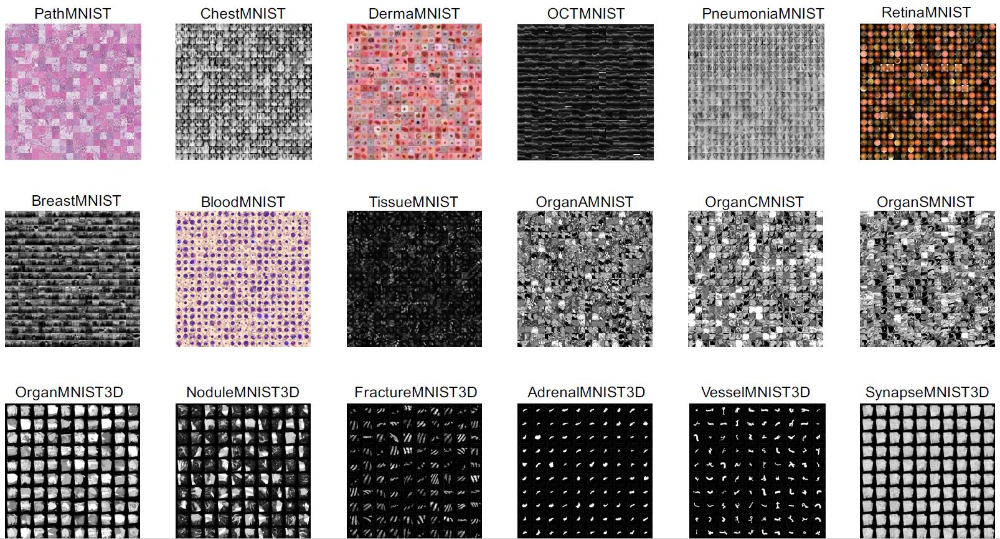

# capstone
This repo is to store and track my capstone project progress, including files, results, codes, and plots.

I use a prefix number to indicate the order of the code file and suffix name to indicate the functionality of a file.

## To reproduce my codes, you have to set up a virtual environment and run them in it.

**Create conda environment on your local system, this is only valid on mac system right now.**

    cd capstone
    conda env create -f environment-mac.yml
    conda activate capstone

# Automatically label medical benchmark images without human manually operation

Nowadays, in hospitals and medical or healthcare system, millions images are generated for patients, treatments and research. However, most of them are unlabelled. To do downstream analysis, labelled images are imperative, but human manually labeling images consumes a large amount of time, thus it is impossible to do that. However, as convolution neural network and natural langauge processing develop, humans are able to label images by taking use of these start-of-the-art techniques automatically without handcarfting.

In order to test my idea and method, I have to find a benchmark medical image database which is light and standard, making the test easier to go on.

## The benchmark image dataset – MedMNIST v2

> We introduce MedMNIST v2, a large-scale MNIST-like collection of standardized biomedical images, including 12 datasets for 2D and 6 datasets for 3D. All images are pre-processed into 28x28 (2D) or 28x28x28 (3D) with the corresponding classification labels, so that no background knowledge is required for users. Covering primary data modalities in biomedical images, MedMNIST v2 is designed to perform classification on lightweight 2D and 3D images with various data scales (from 100 to 100,000) and diverse tasks (binary/multi-class, ordinal regression and multi-label). The resulting dataset, consisting of 708,069 2D images and 10,214 3D images in total, could support numerous research / educational purposes in biomedical image analysis, computer vision and machine learning. We benchmark several baseline methods on MedMNIST v2, including 2D / 3D neural networks and open-source / commercial AutoML tools.

For more information on this dataset, please refer to (https://github.com/LiYuan199701/MedMNIST)

## Read in MedMNIST v2 data with PyTorch

1.Load all packages

    from tqdm import tqdm
    import numpy as np
    import torch
    import torch.nn as nn
    import torch.optim as optim
    import torch.utils.data as data
    import torchvision.transforms as transforms

    import medmnist
    from medmnist import INFO, Evaluator
    
2.For example, load `BreastMNIST`

    data_flag = 'breastmnist'
    download = True

    NUM_EPOCHS = 3
    BATCH_SIZE = 128
    lr = 0.001

    info = INFO[data_flag]
    task = info['task']
    n_channels = info['n_channels']
    n_classes = len(info['label'])

    DataClass = getattr(medmnist, info['python_class'])
    
3.Preprocess and encapsulate them into dataloader

    # preprocessing
    data_transform = transforms.Compose([
        transforms.ToTensor(),
        transforms.Normalize(mean=[.5], std=[.5])
    ])

    # load the data
    train_dataset = DataClass(split='train', transform=data_transform, download=download)
    test_dataset = DataClass(split='test', transform=data_transform, download=download)

    pil_dataset = DataClass(split='train', download=download)

    # encapsulate data into dataloader form
    train_loader = data.DataLoader(dataset=train_dataset, batch_size=BATCH_SIZE, shuffle=True)
    train_loader_at_eval = data.DataLoader(dataset=train_dataset, batch_size=2*BATCH_SIZE, shuffle=False)
    test_loader = data.DataLoader(dataset=test_dataset, batch_size=2*BATCH_SIZE, shuffle=False)

## Apply directly ClIP zero-shot classification models based on ImageNet to this dataset

## Train CLIP zero-shot model on one MedMNIST dataset and apply to another similar dataset
